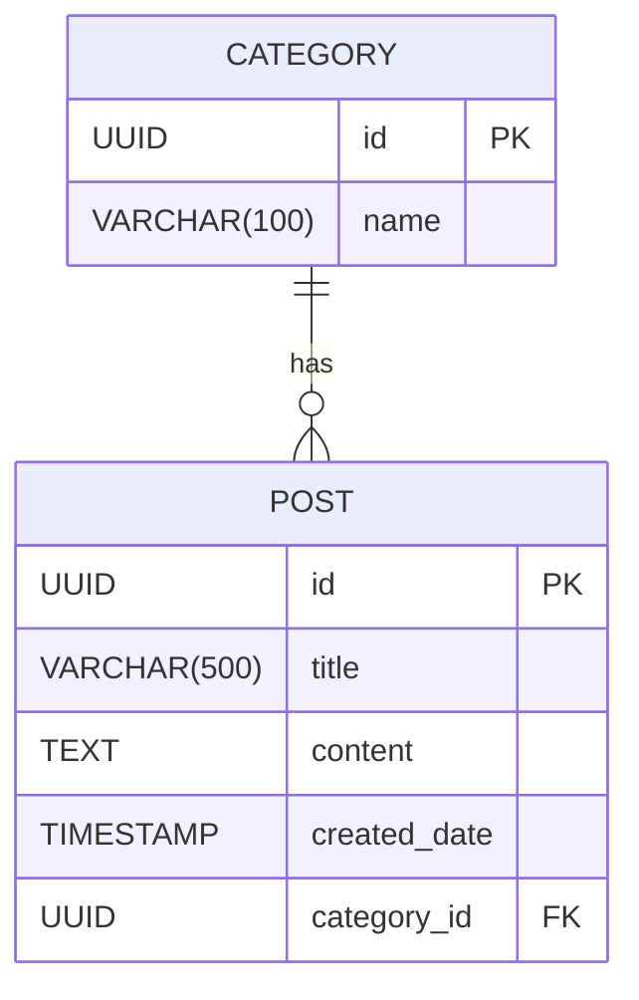
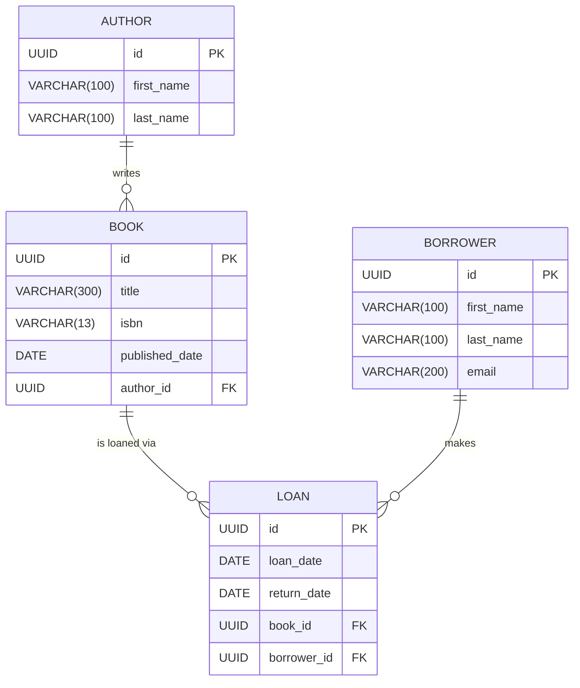
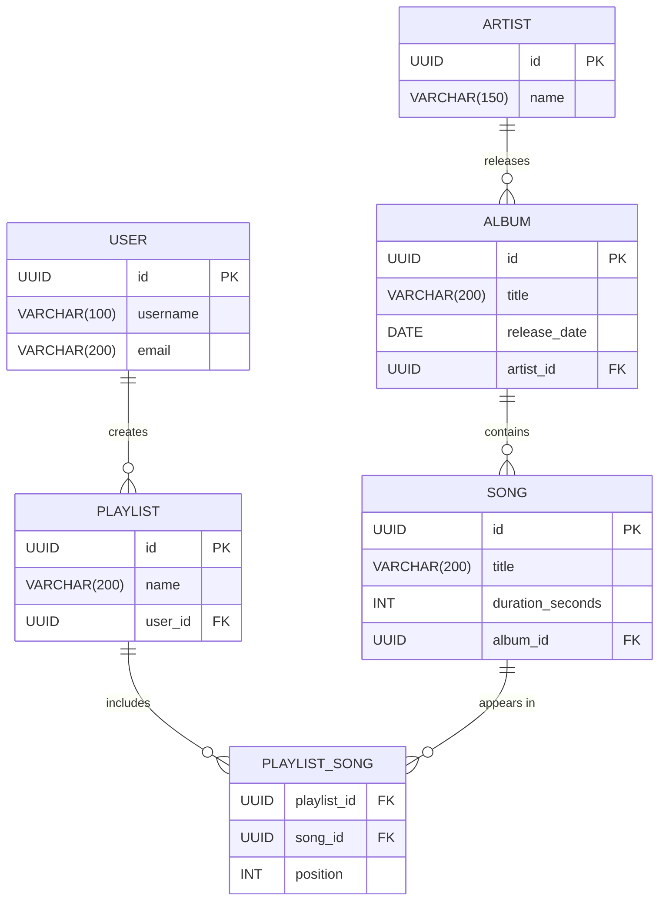
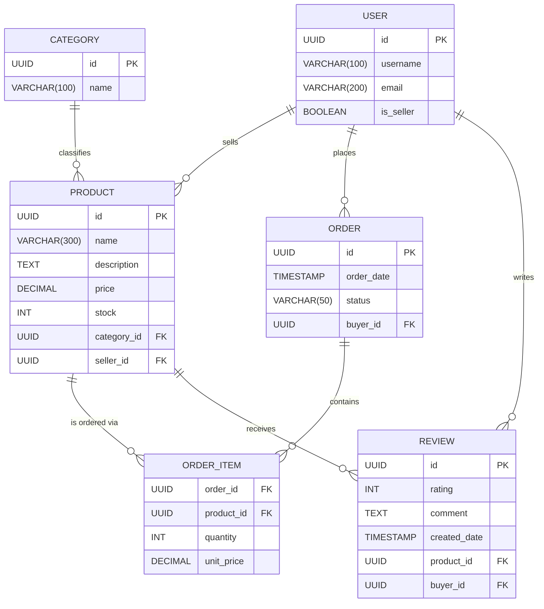

# Data Modeling — Blogger Box

## 1. Blog Platform

```mermaid
erDiagram
    CATEGORY {
        UUID id PK
        VARCHAR(100) name
    }
    POST {
        UUID id PK
        VARCHAR(500) title
        TEXT content
        TIMESTAMP created_date
        UUID category_id FK
    }
    CATEGORY ||--o{ POST : "has"
```

## 2. Library

```mermaid
erDiagram
    AUTHOR {
        UUID id PK
        VARCHAR(100) first_name
        VARCHAR(100) last_name
    }
    BOOK {
        UUID id PK
        VARCHAR(300) title
        VARCHAR(13) isbn
        DATE published_date
        UUID author_id FK
    }
    BORROWER {
        UUID id PK
        VARCHAR(100) first_name
        VARCHAR(100) last_name
        VARCHAR(200) email
    }
    LOAN {
        UUID id PK
        DATE loan_date
        DATE return_date
        UUID book_id FK
        UUID borrower_id FK
    }
    AUTHOR ||--o{ BOOK : "writes"
    BOOK ||--o{ LOAN : "is loaned via"
    BORROWER ||--o{ LOAN : "makes"
```

## 3. Music Streaming

```mermaid
erDiagram
    ARTIST {
        UUID id PK
        VARCHAR(150) name
    }
    ALBUM {
        UUID id PK
        VARCHAR(200) title
        DATE release_date
        UUID artist_id FK
    }
    SONG {
        UUID id PK
        VARCHAR(200) title
        INT duration_seconds
        UUID album_id FK
    }
    USER {
        UUID id PK
        VARCHAR(100) username
        VARCHAR(200) email
    }
    PLAYLIST {
        UUID id PK
        VARCHAR(200) name
        UUID user_id FK
    }
    PLAYLIST_SONG {
        UUID playlist_id FK
        UUID song_id FK
        INT position
    }
    ARTIST ||--o{ ALBUM : "releases"
    ALBUM ||--o{ SONG : "contains"
    USER ||--o{ PLAYLIST : "creates"
    PLAYLIST ||--o{ PLAYLIST_SONG : "includes"
    SONG ||--o{ PLAYLIST_SONG : "appears in"
```

## 4. Marketplace

```mermaid
erDiagram
    USER {
        UUID id PK
        VARCHAR(100) username
        VARCHAR(200) email
        BOOLEAN is_seller
    }
    CATEGORY {
        UUID id PK
        VARCHAR(100) name
    }
    PRODUCT {
        UUID id PK
        VARCHAR(300) name
        TEXT description
        DECIMAL price
        INT stock
        UUID category_id FK
        UUID seller_id FK
    }
    ORDER {
        UUID id PK
        TIMESTAMP order_date
        VARCHAR(50) status
        UUID buyer_id FK
    }
    ORDER_ITEM {
        UUID order_id FK
        UUID product_id FK
        INT quantity
        DECIMAL unit_price
    }
    REVIEW {
        UUID id PK
        INT rating
        TEXT comment
        TIMESTAMP created_date
        UUID product_id FK
        UUID buyer_id FK
    }
    CATEGORY ||--o{ PRODUCT : "classifies"
    USER ||--o{ PRODUCT : "sells"
    USER ||--o{ ORDER : "places"
    ORDER ||--o{ ORDER_ITEM : "contains"
    PRODUCT ||--o{ ORDER_ITEM : "is ordered via"
    USER ||--o{ REVIEW : "writes"
    PRODUCT ||--o{ REVIEW : "receives"
```
